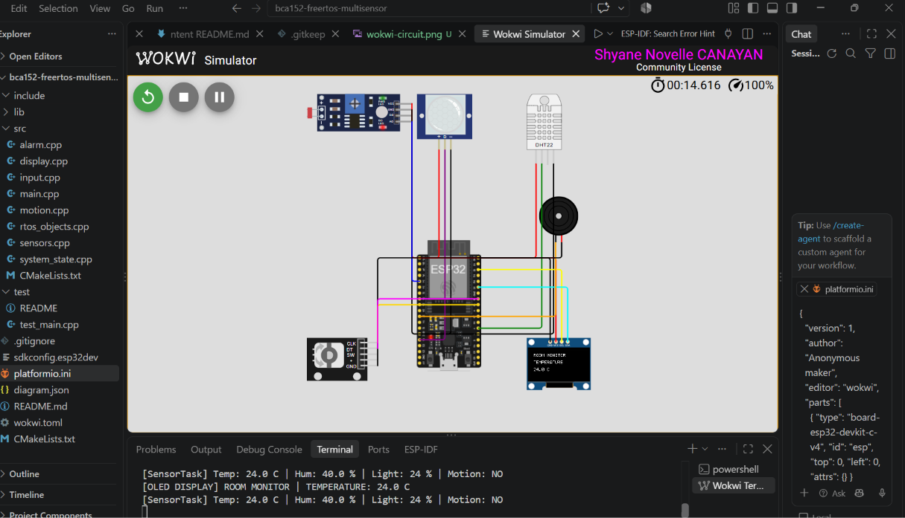
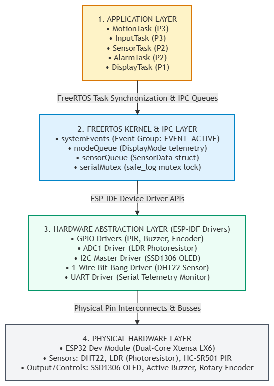
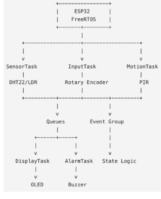
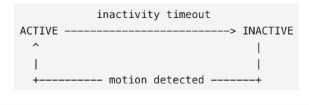
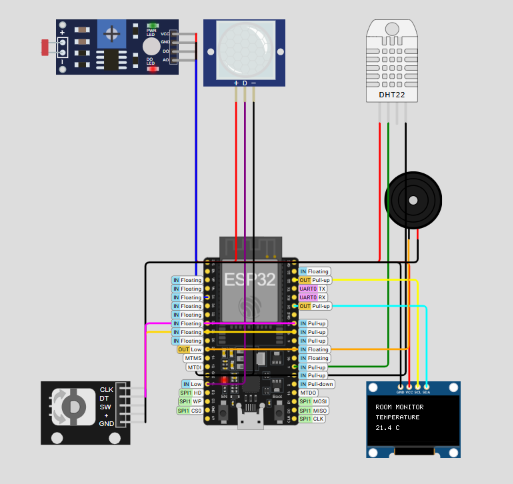

# Real-Time Multisensor Room Monitoring System

## Project Overview
The project makes use of an ESP32 microcontroller together with FreeRTOS and the native ESP-IDF APIs to implement a concurrent, real-time system for monitoring the conditions in a room. It has been designed and verified using the Wokwi simulation platform with PlatformIO; the system collects real-time environmental data comprising temperature, humidity, and ambient light, determines whether or not the room is occupied by means of passive infrared (PIR) sensing, displays diagnostic information on dynamic pages via an SSD1306 OLED display, and triggers an acoustic alarm whenever the room temperature goes outside the safely defined limits.



*Figure 0: Completed multisensor monitoring system running in the Wokwi simulation environment.*

## Features
- **Deterministic Periodic Telemetry**:Environmental sensing using a DHT22 and an LDR photoresistor on a dual-core system in a deterministic periodic manner with drift-free timing.
- **Preemptive Multitasking Concurrency**: The use of a modular FreeRTOS architecture involving five separate tasks, each with its own priority, is known as preemptive multitasking concurrency.
- **Thread-Safe IPC**: For threaded environments, data transfer is achieved using FreeRTOS queues, binary events are signalled using FreeRTOS event groups, and mutual exclusion is provided for serial telemetry.
- **Interactive UI Navigation**:A driver for a quadrature rotary encoder that allows for cyclic page flipping on a 128x64 I2C OLED display. 
- **Dynamic State Machine**: A dynamic state machine that automatically switches between ACTIVE and INACTIVE power-saving states according to motion timeouts.
- **Automated Verification**: Automated verification is achieved by incorporating the Unity unit testing framework and using cppcheck for zero-defect static code analysis.

## Learning Objectives
- Develop concurrent embedded firmware strictly under Espressif IoT Development Framework (ESP-IDF) and FreeRTOS without Arduino wrappers.
- Avoid race conditions, task starvation and timing drift with queues, mutexes, event flags and vTaskDelayUntil().
- Adopt a modular software architecture that cleanly separates hardware-independent decision logic from peripheral abstraction drivers.
- Apply complete software engineering practices, such as automated unit tests, static analysis, structured documentation and Git version control.

## System Architecture
The system is organized into four layers, keeping the application logic separate from the underlying hardware:



*Figure 1: System architecture, showing how hardware access, drivers, FreeRTOS, and application tasks are separated into layers.*

## FreeRTOS Architecture
Five tasks run concurrently on the system, with priorities assigned based on urgency and acceptable delay.



*Figure 2: FreeRTOS task communication graph illustrating task responsibilities, communication pipes, and peripheral endpoints.*

## Hardware / Simulated Components
| Component | Interface / Protocol | Primary Responsibility |
| :--- | :--- | :--- |
| **ESP32-WROOM-32** | Tensilica Xtensa Dual-Core | Main microcontroller and real-time coordinator |
| **DHT22 (AM2302)** | Single-Bus Bit-Bang | Digital temperature and humidity measurement |
| **Photoresistor / LDR** | ADC1 Single-Shot (0–3.3V) | Ambient light level monitoring (normalized 0–100%) |
| **HC-SR501 PIR** | Digital Input (GPIO) | Simulated motion and room occupancy detection |
| **Rotary Encoder** | Quadrature Gray Code | User input for dashboard display navigation |
| **SSD1306 OLED** | I2C Master (0x3C) | Dynamic graphical telemetry presentation |
| **Active Buzzer** | Digital Push-Pull (GPIO) | Acoustic alarm output for temperature violations |

## Pin Configuration
| Peripheral | Pin Label | ESP32 GPIO | Mode / Configuration |
| :--- | :--- | :--- | :--- |
| **DHT22 Data** | SDA / OUT | `GPIO 4` | Open-drain pull-up / Bit-bang bidirectional |
| **LDR Photoresistor** | A0 | `GPIO 34` | Analog Input (ADC1_CHANNEL_6, 12-bit) |
| **PIR Motion Sensor** | OUT | `GPIO 13` | Digital Input with internal pull-down |
| **Rotary Encoder CLK** | CLK | `GPIO 18` | Digital Input with internal pull-up |
| **Rotary Encoder DT** | DT | `GPIO 19` | Digital Input with internal pull-up |
| **SSD1306 OLED SDA** | SDA | `GPIO 21` | I2C Data Master (400 kHz Fast Mode) |
| **SSD1306 OLED SCL** | SCL | `GPIO 22` | I2C Clock Master (400 kHz Fast Mode) |
| **Active Buzzer** | Positive (+) | `GPIO 23` | Digital Output (Active High Push-Pull) |

## Task Design
| Task Name | Responsibility | Trigger / Period | Priority | Assigned Core | Typical Block Condition |
| :--- | :--- | :--- | :--- | :--- | :--- |
| `MotionTask` | Monitor PIR activity and refresh wake states | 50 ms periodic | 3 | Core 0 | `vTaskDelay` |
| `InputTask` | Process rotary-encoder navigation | 20 ms periodic | 3 | Core 0 | `vTaskDelay` |
| `SensorTask` | Read DHT22 and LDR periodically | 2000 ms periodic | 2 | Core 1 | `vTaskDelayUntil` |
| `AlarmTask` | Evaluate alarm state and control buzzer | On sensor queue update | 2 | Core 1 | `xQueueReceive` (Block) |
| `DisplayTask` | Own and manage OLED rendering | On mode update / telemetry | 1 | Core 1 | `xQueueReceive` (Block) |

### Priority Justification
- **Priority 3 (`InputTask`, `MotionTask`)**: Encoder input and motion pulses are brief signals that can easily be missed. If a task isn't scheduled promptly, an encoder click or motion event could be lost, so these tasks are given the highest priority to stay responsive.
- **Priority 2 (`SensorTask`, `AlarmTask`)**: Reading sensor data takes only a few tens of milliseconds. Since alarm decisions depend on having up-to-date readings, this task runs right after new data is ready to keep the alarm response timely.
- **Priority 1 (`DisplayTask`)**: Updating the OLED means sending 1024 bytes over I2C, which takes noticeably longer than other tasks. Giving it the lowest priority keeps screen updates from delaying more time-sensitive work like sensor readings or user input.

## Inter-Task Communication
Thread synchronization avoids race conditions and data corruption across dual-core operations:
- **`sensorQueue` (Depth 1)**: Transfers structured `SensorData` payloads from `SensorTask` to both `DisplayTask` and `AlarmTask` using `xQueueOverwrite()`.
- **`modeQueue` (Depth 1)**: Conveys current enumerated display pages from `InputTask` to `DisplayTask`.
- **`systemEvents` (Event Group)**: Manages `EVENT_ACTIVE` (Bit 0) flags to coordinate wake/sleep transitions between `MotionTask` and consumers.
- **`serialMutex`**: Guarded using `xSemaphoreTake(serialMutex, portMAX_DELAY)` within `safe_log()` to prevent interleaved writes during UART diagnostic reporting.

## State Machine
The system controls when the display wakes and sleeps using a simple two-state state machine.



*Figure 3: System state-machine transition model.*

- **`ACTIVE` State**: The OLED screen is illuminated, telemetry screens rotate dynamically upon encoder input, sensors cycle normally, and acoustic alarms fire if temperatures violate bounds ($< 18^\circ\text{C}$ or $> 30^\circ\text{C}$).
- **`INACTIVE` State**: If no PIR motion is recorded for $\ge 15$ seconds, the system enters `INACTIVE`. The OLED screen clears to conserve power, while background sensor polling and PIR monitoring remain active. Subsequent PIR movement restores the system to `ACTIVE`.

## Repository Structure
```text
bca152-freertos-multisensor/
├── .vscode/               # VS Code PlatformIO workspace definitions
├── docs/
│   ├── images/
│   │   ├── finished-system.png
│   │   ├── freertos-architecture.png
│   │   ├── state-machine.png
│   │   ├── system-architecture.png
│   │   └── wokwi-circuit.png
│   └── laboratory-report.pdf
├── include/               # Public firmware API definitions
│   ├── alarm.h
│   ├── display.h
│   ├── input.h
│   ├── motion.h
│   ├── rtos_objects.h
│   ├── sensors.h
│   └── system_state.h
├── src/                   # Implementation units
│   ├── alarm.cpp
│   ├── display.cpp
│   ├── input.cpp
│   ├── main.cpp
│   ├── motion.cpp
│   ├── rtos_objects.cpp
│   ├── sensors.cpp
│   └── system_state.cpp
├── test/                  # Unity automated verification suites
│   ├── test_alarm.cpp
│   ├── test_navigation.cpp
│   └── test_state.cpp
├── diagram.json           # Wokwi simulation component layout
├── platformio.ini         # PlatformIO toolchain & framework flags
├── README.md              # Public engineering portfolio documentation
└── wokwi.toml              # Wokwi simulator bridging configurations
```

## Getting Started

### Prerequisites
- Visual Studio Code
- PlatformIO IDE Extension
- Wokwi Simulator Extension
- Python 3.10+ and Git CLI

### Installation
Clone the repository to your local development environment:

```bash
git clone https://github.com/YOUR_USERNAME/bca152-freertos-multisensor.git
cd bca152-freertos-multisensor
```

## Building the Project
Compile the firmware binaries using the PlatformIO command-line toolchain:

```bash
pio run
```

## Running the Wokwi Simulation


*Figure 4: Wokwi circuit layout showing the ESP32, DHT22, LDR, PIR sensor, rotary encoder, SSD1306 OLED, and buzzer wiring.*

1. Press `Ctrl + Shift + P` inside VS Code to trigger the Command Palette.
2. Search and select `Wokwi: Start Simulator`.
3. Interact with the simulation canvas:
   - Adjust the slide potentiometer on the DHT22 to mutate temperature and humidity.
   - Click the PIR sensor to simulate human movement.
   - Turn the rotary encoder knob to page between sensor dashboards.

## Unit Testing
The business logic is hardware-abstracted to enable off-target automated unit tests using the Unity testing framework:

```bash
pio test
```

### Test Suite Coverage (13 Tests Executed)
- **Temperature Alarm Logic** (`evaluateTemperature`):
  - Below lower threshold ($< 18^\circ\text{C}$) → `LOW_TEMPERATURE`
  - Exactly at lower threshold ($= 18^\circ\text{C}$) → `NORMAL`
  - Normal room temperature ($24^\circ\text{C}$) → `NORMAL`
  - Exactly at upper threshold ($= 30^\circ\text{C}$) → `NORMAL`
  - Above upper threshold ($> 30^\circ\text{C}$) → `HIGH_TEMPERATURE`
- **Display Navigation Logic** (`nextDisplayMode` / `previousDisplayMode`):
  - Sequential forward traversal (`TEMPERATURE` → `HUMIDITY` → `LIGHT` → `MOTION`)
  - Forward boundary wraparound (`MOTION` → `TEMPERATURE`)
  - Reverse traversal (`LIGHT` → `HUMIDITY`)
  - Reverse boundary wraparound (`TEMPERATURE` → `MOTION`)
- **State Machine Transitions** (`evaluateSystemState`):
  - `ACTIVE` state sustained when elapsed time $<$ timeout.
  - `ACTIVE` transitions to `INACTIVE` when elapsed time $\ge 15$ seconds without motion.
  - `INACTIVE` state maintained while motion remains false.
  - `INACTIVE` immediately returns to `ACTIVE` upon detected motion.

## Static Code Analysis
Firmware safety and compliance are audited via `pio check` (cppcheck engine):

```bash
pio check
```

### Static Analysis Findings Table
| Findings | File/Line | Cause | Resolution |
| :--- | :--- | :--- | :--- |
| [low:portability] Using `memset()` on struct which contains a floating point number | `src/alarm.cpp:28` | `memset()` was applied to a data structure containing floating-point fields (temperature, humidity). Although an all-zero bit pattern represents 0.0f under the IEEE 754 floating-point standard used by the ESP32, Cppcheck flags this pattern as non-portable across non-standard floating-point architectures. | Analyzed and Accepted: The ESP32 Xtensa architecture strictly adheres to IEEE 754 single-precision representation. Zero-initialization via `memset()` introduces no runtime or logical defects, though zero-initialization syntax (`SensorData data = {};`) is preferred going forward. |
| [low:portability] Using `memset()` on struct which contains a floating point number | `src/display.cpp:221` | A local `SensorData` buffer was cleared using `memset()` prior to polling `sensorQueue`. | Analyzed and Accepted: Verified safe for the Xtensa core target. The operation incurs negligible execution overhead and causes no undefined behavior or memory corruption during task execution. |
| [low:portability] Using `memset()` on struct which contains a floating point number | `src/sensors.cpp:104` | `memset()` was used to clear the internal telemetry buffer within the sensor sampling driver. | Analyzed and Accepted: Confirmed on the target platform. Memory layout remains valid across all builds, with zero impact on numerical calculations or sensor queue operations. |

## Functional Verification

### Verification Record — Functional Verification in Wokwi
| ID | Stimulus | Expected | Actual | Result |
| :--- | :--- | :--- | :--- | :--- |
| FT-01 | Set DHT22 temperature slider to 54.7 °C in Wokwi | 54.7 °C displayed | Serial monitor logged `[SensorTask]` Temp: 54.7 °C, and OLED updated during the next 1 s refresh interval. | PASS |
| FT-02 | Set DHT22 relative humidity slider to 65.5 % in Wokwi | 65 % displayed | `[SensorTask]` logged Hum: 65.5 %; value reflected on the OLED display under humidity mode. | PASS |
| FT-03 | Adjust LDR lux slider to achieve an illumination change | 38% displayed | ADC reading was scaled to percentage, logging Light: 38 % on the serial output and OLED. | PASS |
| FT-04 | Rotate the rotary encoder clockwise (CW) by one detent | Humidity displayed | Rotary input decoded falling edge; logged `[InputTask]` CW -> Mode: 1 and advanced screen to Humidity. | PASS |
| FT-05 | Rotate the rotary encoder counter-clockwise (CCW) while at Mode 0 | Mode 3 displayed : Temperature | Quadrature decoder registered CCW rotation; logged `[InputTask]` CCW -> Mode: 3 and wrapped around cleanly. | PASS |
| FT-06 | Adjust DHT22 temperature above 30°C | Setting it into 48.3 °C; buzzer activates | Alarm evaluation returned ALARM_HIGH_TEMPERATURE; buzzer GPIO logic level transitioned to active-high with alert logging. | PASS |
| FT-07 | Lower DHT22 temperature back to 24.0 °C (within normal 18–30 °C) | Setting it into 21.4 °C; buzzer output turns off | `evaluateTemperature()` returned ALARM_NORMAL; buzzer GPIO pin was driven low, clearing acoustic alarm. | PASS |
| FT-08 | Click "Simulate motion" button on the PIR motion sensor | System recognizes motion and sets/retains ACTIVE state | GPIO 13 transitioned high; `MotionTask` logged Motion: YES and set the EVENT_ACTIVE | PASS |
| FT-09 | Cease motion stimulus and allow inactivity timer to elapse beyond 15 s | System times out and enters INACTIVE low-power state | `MotionTask` evaluated inactivity timeout; logged `[MotionTask]` Inactivity timeout (15s)! System -> INACTIVE, cleared EVENT_ACTIVE, and OLED turned off. | PASS |
| FT-10 | Trigger PIR motion stimulus while system is in INACTIVE state | System awakens and immediately returns to ACTIVE state | Motion interrupt/polling resumed active state; EVENT_ACTIVE bit was set, restored display updates, and logged telemetry stream | PASS |

## Engineering Decisions
- **Native ESP-IDF Framework Selection**: Chose direct ESP-IDF APIs over Arduino wrappers to get full access to native FreeRTOS features and more precise, microsecond-level timing control.
- **Drift-Free Scheduling via `vTaskDelayUntil()`**: Standard `vTaskDelay()` produces cumulative timing drift because execution durations vary before delay calls. `vTaskDelayUntil()` calculates absolute tick offsets, ensuring strict 2000 ms cadence for DHT22 readings.
- **Display Ownership Pattern**: Only DisplayTask is allowed to write to the OLED over I2C. Keeping rendering separate from the sensor-reading tasks avoids bus conflicts and stops the display from flickering.

## Limitations
- Wokwi treats the ADC as perfectly linear, but real ESP32 ADC1 channels aren't. They get less accurate near 0.1V and 3.2V, which would need polynomial calibration to correct on actual hardware.
- Real HC-SR501 PIR sensors need 30–60 seconds to stabilize after power-on, but the simulation skips this warm-up period entirely.
- The 15-second inactivity timeout was suitable for rapid testing during laboratory trials (FT-09). In practical use, however, this duration is too short, since a person remaining still in the room would cause the display to repeatedly turn off and back on. 
- The DHT22 and LDR sensors respond cleanly in Wokwi without any electronic noise. On actual hardware, breadboard wires and power fluctuations cause small signal delays and false checksum errors during DHT22 readouts.
- The temperature thresholds and inactivity timeout are saved in RAM. If the board loses power or resets, all values return to the default code settings because flash memory (NVS) is not used.
- When the system switches to the INACTIVE state, only the OLED screen turns off. The ESP32 CPU and sensors stay fully powered on, so the board still drains battery power at nearly the same rate.
- Because DisplayTask handles all screen drawing on Core 1 to prevent bus conflicts, any delay in sensor processing on that core slows down the screen updates.
- Using a queue depth of 1 always replaces the previous reading with the newest one. This keeps current data fresh, but sudden brief temperature spikes are lost if the display task is busy drawing a frame.

## Future Improvements
- Replace manual software delays with the ESP32 RMT (Remote Control) peripheral to read the sensor signal accurately and avoid checksum errors on real hardware.
- Integrate ESP32 Wi-Fi / MQTT networking tasks to publish room metrics to a remote IoT dashboard or cloud broker.
- Introduce Light Sleep / Deep Sleep power modes triggered during `INACTIVE` cycles to reduce battery consumption.
- Store user-adjusted temperature limits and screen timeout intervals in the ESP32 Non-Volatile Storage (NVS) so preferences are not wiped during a power loss or reboot.
- Add a low-priority networking task to publish sensor readings to a local Home Assistant server or an MQTT dashboard for remote monitoring over the web.

## References and Acknowledgments
- Espressif Systems. *ESP-IDF Programming Guide: FreeRTOS Architecture & APIs*.
- Richard Barry. *Mastering the FreeRTOS Real Time Kernel: A Hands-On Tutorial Guide*.
- Asst. Prof. Paul Rodolf P. Castor, M.Sc., *BCA152 Microcontrollers Laboratory Activity 1 Manual*, September 2026.